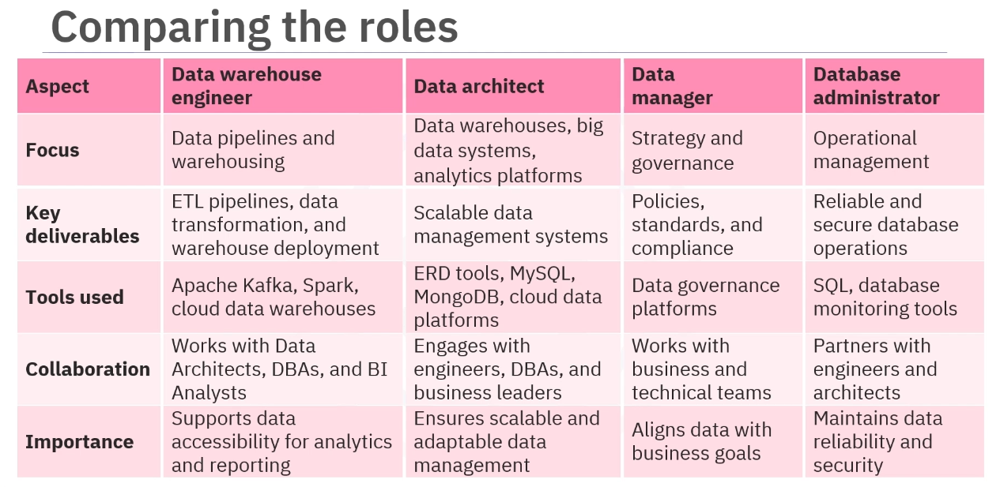

# Course

# [Introduction to Data Engineering](https://www.coursera.org/learn/introduction-to-data-engineering)

## DATA SOURCES

1. Structured Data
- Organized into predefined schema (rows/columns, fixed fields)
- Easily stored in relational databases
- Queryable with SQL
- High consistency, low ambiguity
- Examples: transactional records, spreadsheets, CRM tables, sensor readings

2. Unstructured Data
- No predefined data model or schema
- Requires processing before structured analysis
- Often text- or media-heavy
- Higher ambiguity, higher volume
- Examples: emails, PDFs, images, videos, audio files, social media posts

## DATA ROLES OVERVIEW

1. Data Analyst  
Raw Data → Cleaned / Structured Data → Insights  
- Cleans, transforms, validates data  
- Performs exploratory analysis  
- Builds dashboards and reports  
- Answers: “What happened?” and “Why did it happen?”  

2. Data Scientist  
Data Analysis + Data Engineering → Predictive / Prescriptive Models  
- Builds statistical and machine learning models  
- Uses historical data to predict future outcomes  
- Performs experimentation and model evaluation  
- Answers: “What will happen?” and “What should we do?”  

3. Business Analyst / Business Intelligence (BI) Analyst  
Insights + Predictions → Business Decisions  
- Translates analytical results into strategic actions  
- Defines KPIs and performance metrics  
- Aligns data outcomes with business objectives  
- Answers: “What decision should be made?” and “How does this impact the business?”

## Specializations in Data Engineering

- Data Warehouse Engineer  
Designs, builds, and maintains data warehouses.  
Implements ETL(Extract Transport Load)/ELT(Extract Load Transport) pipelines.  
Optimizes data models for analytics and reporting.

- Data Architect  
Designs overall data infrastructure and architecture.  
Defines data models, standards, and integration patterns.  
Ensures scalability, reliability, and security.

- Data Manager  
Oversees data governance and data quality.  
Defines data policies and compliance standards.  
Coordinates data access and lifecycle management.

- Database Administrator (DBA)  
Manages and maintains database systems.  
Handles performance tuning, backups, and recovery.  
Ensures availability, integrity, and security of databases.

## Example Scenarios / Test Cases

### Data Warehouse Engineer
**Scenario:** Sales data from multiple regional systems must be unified for executive reporting.  
**Task:**  
- Design ETL pipeline to extract data from 5 source systems.  
- Clean and standardize schemas.  
- Load into a centralized warehouse.  
- Optimize star schema for BI queries.

---

### Data Architect
**Scenario:** Company migrating from on-prem infrastructure to cloud.  
**Task:**  
- Design scalable data architecture.  
- Choose storage solutions (data lake vs warehouse).  
- Define data flow between ingestion, processing, and analytics layers.  
- Establish data standards and security controls.

---

### Data Manager
**Scenario:** Inconsistent customer records across departments.  
**Task:**  
- Define data governance rules.  
- Establish master data management process.  
- Enforce data quality checks.  
- Ensure compliance with data protection regulations.

---

### Database Administrator (DBA)
**Scenario:** Production database experiencing slow queries and downtime.  
**Task:**  
- Analyze query performance.  
- Add indexing and optimize queries.  
- Configure backup and disaster recovery strategy.  
- Monitor uptime and system health.

## Data Engineering

Involves:
- Data ingestion (collecting data from multiple sources)
- Data transformation (cleaning, validating, structuring)
- Data storage (data lakes, data warehouses, databases)
- Data pipeline development (ETL / ELT workflows)
- Data modeling (designing schemas for analytics)
- Data orchestration and scheduling
- Data quality management
- Performance optimization and scalability
- Security and access control
- Monitoring and maintenance of data systems

## Responsibilities:
- Design and build data pipelines  
- Develop and maintain ETL / ELT processes  
- Integrate data from multiple sources  
- Ensure data quality and reliability  
- Optimize data storage and query performance  
- Implement data security and access controls  
- Monitor, troubleshoot, and maintain data systems  
- Collaborate with analysts, scientists, and stakeholders  

## Technical Skills:
- SQL (advanced querying and optimization)  
- Programming (Python, Java, or Scala)  
- ETL tools and workflow orchestration  
- Data modeling (star/snowflake schemas)  
- Database systems (relational and NoSQL)  
- Data warehousing concepts  
- Distributed processing frameworks  
- Cloud data platforms  
- Version control and CI/CD basics  
- System design fundamentals

## Functional Skills
- Analytical thinking  
- Problem-solving  
- Understanding business requirements  
- Communication with technical and non-technical stakeholders  
- Documentation and knowledge management  
- Data governance awareness  
- Attention to detail  
- Process optimization mindset  
- Collaboration across teams  
- Time and priority management

## Soft Skills
- Clear communication  
- Critical thinking  
- Adaptability  
- Accountability  
- Ownership mindset  
- Team collaboration  
- Conflict resolution  
- Continuous learning discipline  
- Decision-making under constraints  
- Attention to detail

## Tools

- Languages, e.g.:
  - SQL  
  - Python  
  - Java  
  - Scala  

- Automation / Orchestration Tools, e.g.:
  - Apache Airflow  
  - Prefect  
  - Dagster  

- Data Processing Frameworks, e.g.:
  - Apache Spark  
  - Apache Flink  

- Data Warehousing Platforms, e.g.:
  - Snowflake  
  - Google BigQuery  
  - Amazon Redshift  

- Databases, e.g.:
  - PostgreSQL  
  - MySQL  
  - MongoDB  

- Cloud Platforms, e.g.:
  - AWS  
  - Google Cloud Platform (GCP)  
  - Microsoft Azure  

- Version Control, e.g.:
  - Git  
  - GitHub  
  - GitLab  
